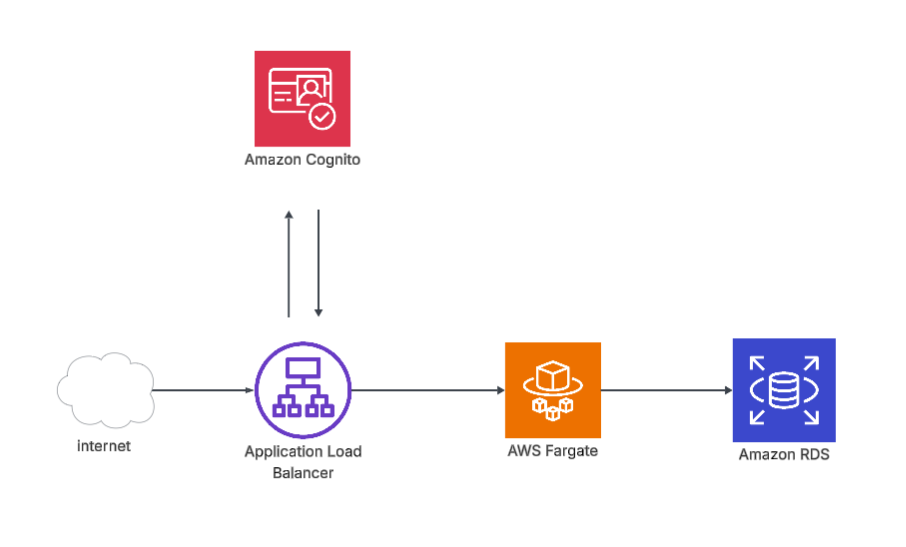

# AppCarSales

## 📋 Sobre o Projeto

O **AppCarSales** é uma aplicação de gerenciamento de vendas de veículos desenvolvida com **Quarkus**. O sistema permite o cadastro e atualização de veículos, além de gerenciar todo o processo de vendas, desde a reserva até a confirmação do pagamento.

## Link para o vídeo demonstrando a aplicação
https://youtu.be/04JYQGnrpPY

## Arquitetura da Aplicação



## Tecnologias Utilizadas

- **Java 21** - Linguagem de programação
- **Quarkus 3.30.1** - Framework principal
- **Hibernate ORM com Panache** - Persistência de dados
- **MySQL** - Banco de dados relacional
- **Lombok** - Redução de boilerplate code
- **SmallRye OpenAPI** - Documentação de API
- **SmallRye Health** - Health checks
- **Jakarta REST (JAX-RS)** - API REST
- **Jackson** - Serialização JSON

### Estrutura do Projeto

```
src/main/java/tech/challenge/
├── controllers/          # Endpoints REST
│   ├── CarController.java
│   └── SaleController.java
├── entities/            # Entidades JPA
│   ├── CarEntity.java
│   └── SaleEntity.java
├── services/            # Lógica de negócio
│   ├── CarService.java
│   └── SaleService.java
├── enums/               # Enumerações
│   ├── CarStatus.java
│   └── PaymentStatus.java
└── healthcheck/         # Health checks
    └── DatabaseHealthCheck.java
```

## Como Rodar Localmente


1. Clone o repositório:

```bash
git clone <url-do-repositorio>
cd appcarsales
```

2. Execute a aplicação em modo dev:

```bash
./mvnw quarkus:dev
```

A aplicação estará disponível em:
- **API**: http://localhost:8080
- **Swagger UI**: http://localhost:8080/q/swagger-ui
- **Dev UI**: http://localhost:8080/q/dev
- **Health Check**: http://localhost:8080/q/health

### Executando com Docker

1. Compile o projeto:

```bash
./mvnw package
```

2. Construa a imagem Docker:

```bash
docker build -f src/main/docker/Dockerfile.jvm -t appcarsales:latest .
```

3. Execute o container (ajuste as variáveis de ambiente conforme necessário):

```bash
docker run -i --rm -p 8080:8080 \
  -e QUARKUS_DATASOURCE_JDBC_URL=jdbc:mysql://host.docker.internal:3306/carsales_db \
  -e QUARKUS_DATASOURCE_USERNAME=carsales_user \
  -e QUARKUS_DATASOURCE_PASSWORD=carsales_password \
  appcarsales:latest
```


## 📊 API Endpoints

### Veículos (`/cars`)

| Método | Endpoint | Descrição |
|--------|----------|-----------|
| POST | `/cars` | Cadastra um novo veículo |
| PUT | `/cars/{carId}` | Atualiza dados de um veículo disponível |
| GET | `/cars/available` | Lista veículos disponíveis (ordenados por preço) |
| GET | `/cars/sold` | Lista veículos vendidos (ordenados por preço) |

### Vendas (`/sales`)

| Método | Endpoint | Descrição |
|--------|----------|-----------|
| POST | `/sales` | Cria uma nova venda (reserva o veículo) |
| PATCH | `/sales/{saleId}` | Confirma o pagamento da venda |
